# PyRaftKV

<p align="center">
  <strong>A fault-tolerant distributed key-value store built in Python with the Raft consensus algorithm.</strong>
</p>

<p align="center">
  
  
  
  
  
</p>

---

## What is PyRaftKV?

**PyRaftKV** is a distributed key-value database built to make distributed-systems concepts practical and easy to see.

A normal key-value store saves data like this:

```text
name = Harsha
language = Python
project = PyRaftKV
```

A single-server database is simple:

```text
Client ---> Server ---> Data
```

But if that server crashes, the service stops.

PyRaftKV runs the same logical database across multiple nodes. The nodes use the **Raft consensus algorithm** to agree on:

- which node is the leader,
- which writes are accepted,
- the order of those writes,
- when a write is committed,
- and how failed or restarted nodes catch up.

The default Docker setup runs a **3-node Raft cluster**.

> PyRaftKV is an educational engineering project. It is designed for learning, testing, and demonstrating distributed-system behavior. It is not intended to replace production systems such as etcd, Consul, ZooKeeper, or a production distributed database.

---

## Table of Contents

- [Project at a Glance](#project-at-a-glance)
- [The Big Idea](#the-big-idea)
- [Raft in Simple Words](#raft-in-simple-words)
- [Main Features](#main-features)
- [System Architecture](#system-architecture)
- [What Happens During a Write?](#what-happens-during-a-write)
- [How a Read Works](#how-a-read-works)
- [What Happens if the Leader Crashes?](#what-happens-if-the-leader-crashes)
- [Snapshots and Log Compaction](#snapshots-and-log-compaction)
- [Persistence and Restart Recovery](#persistence-and-restart-recovery)
- [Quick Start with Docker](#quick-start-with-docker)
- [Using the API](#using-the-api)
- [Cluster Status](#cluster-status)
- [Prometheus Metrics and Monitoring](#prometheus-metrics-and-monitoring)
- [Automated Failover Demo](#automated-failover-demo)
- [Development Setup](#development-setup)
- [Testing](#testing)
- [Failure and Stress Testing](#failure-and-stress-testing)
- [Raft Concepts](#raft-concepts)
- [Project Structure](#project-structure)
- [Benchmarks](#benchmarks)
- [Current Limitations](#current-limitations)
- [Documentation](#documentation)
- [Release Validation](#release-validation)
- [Five-Minute Learning Path](#five-minute-learning-path)

---

## Project at a Glance

| Area | What PyRaftKV provides |
|---|---|
| Storage | Key-value `PUT`, `GET`, and `DELETE` |
| Consensus | Raft leader election and majority quorum |
| Replication | Replicated Raft log with conflict repair |
| Reads | Leader-backed linearizable reads |
| Persistence | Durable term, vote, commit index, journal, and snapshots |
| Recovery | Restart recovery and follower catch-up |
| Snapshots | Snapshot persistence, log compaction, `InstallSnapshot` |
| Failure handling | Leader failure, follower failure, partitions, delayed/dropped RPCs |
| Operations | `/health`, `/cluster/status`, `/metrics` |
| Monitoring | Prometheus + Grafana |
| Testing | Unit, integration, failure, snapshot, and concurrent stress tests |
| Demo | Automated Docker leader-failover demonstration |
| Release | `v1.0.0` |

---

## The Big Idea

Imagine three servers:

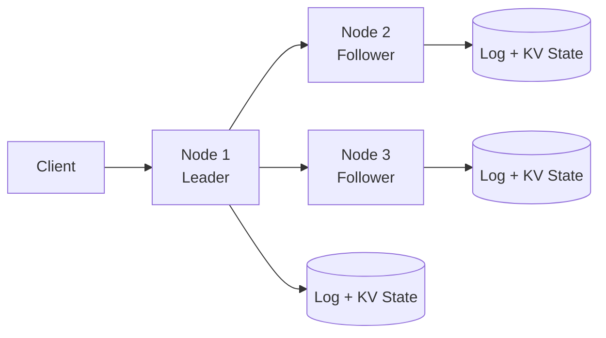

Only one node is normally the **leader**. The leader accepts distributed writes and replicates them to followers.

For a 3-node cluster:

```text
3 nodes total
majority = 2
```

This means the cluster can normally continue making progress even if **one node is unavailable**.

---

## Raft in Simple Words

Every PyRaftKV node is normally in one of three roles:

```text
Follower
Candidate
Leader
```

### Follower

A follower listens to the current leader and replicates its log.

### Candidate

If a follower stops hearing from a leader long enough, it can become a candidate and request votes.

### Leader

A candidate that receives a majority of votes becomes the leader. The leader coordinates new writes and log replication.

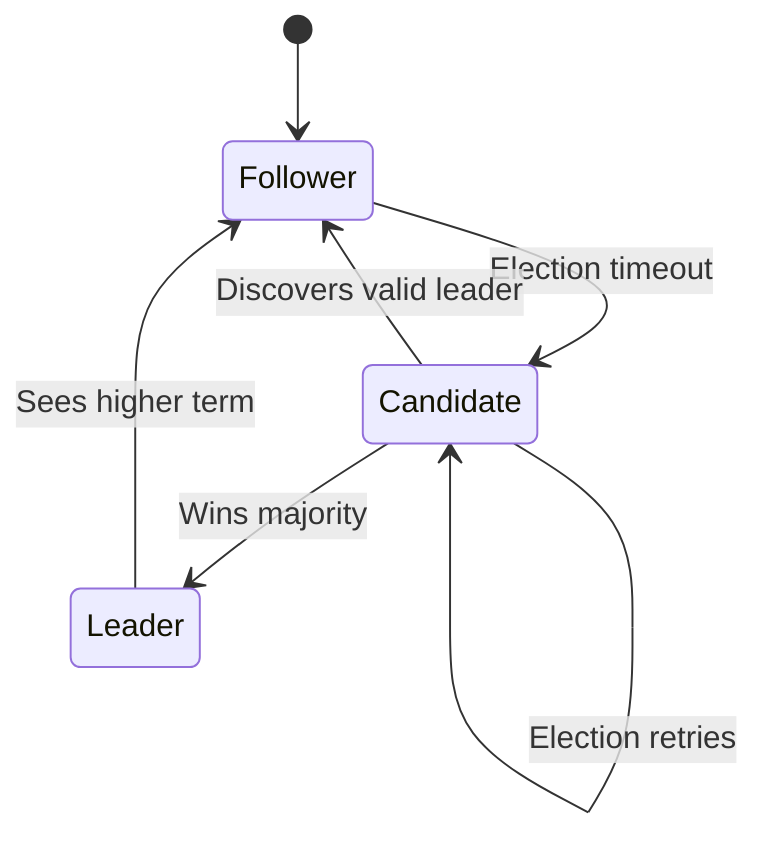

Raft gives all nodes a common set of rules for deciding who leads and which history is committed.

---

## Main Features

### Key-value operations

Client-facing operations:

```text
PUT    /kv/{key}
GET    /kv/{key}
DELETE /kv/{key}
```

### Leader election

Nodes use randomized election timeouts and `RequestVote` RPCs to elect a leader.

### Heartbeats

The leader regularly contacts followers so they know that a valid leader is still active.

### Replicated log

Writes are represented as ordered Raft log entries before they are applied to the key-value state machine.

### Majority commit

A request is not considered safely committed simply because the leader received it. The leader must satisfy Raft's quorum rules.

### Conflict repair

If a follower's history differs from the leader, the leader backs up replication and repairs the follower until their histories agree.

### Linearizable reads

Leader reads use quorum/leadership confirmation so the API does not silently return stale local state as authoritative.

### Conservative read lease

A short monotonic read lease can avoid unnecessary quorum round trips immediately after leadership has already been safely confirmed.

### Durable persistence

Important Raft state survives process restart.

### Snapshots and log compaction

Old committed history can be represented by a snapshot so the active Raft log does not need to grow forever.

### InstallSnapshot

A follower that is behind compacted history can recover from a snapshot and then continue normal replication.

### Leadership transfer

The implementation supports best-effort graceful leadership transfer for planned shutdown.

### Deterministic fault injection

Tests can simulate partitions, dropped messages, delayed messages, node failures, and recovery without relying on random real-network failures.

### Observability

Prometheus metrics and a Grafana dashboard expose important cluster behavior.

---

## System Architecture

Each node combines an HTTP API, Raft state, replicated log, key-value state machine, persistence, transport, and monitoring.

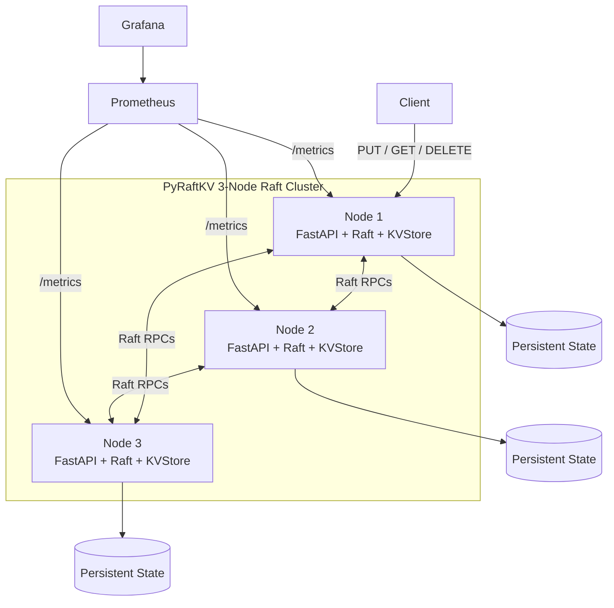

The client should not assume that `node1` is permanently the leader. Any eligible node may become leader after an election.

The Raft logic is also separated from the exact transport implementation:

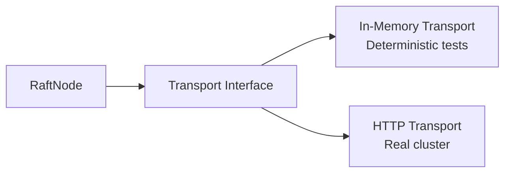

This lets the same Raft behavior be tested quickly without requiring Docker for every test.

---

## What Happens During a Write?

Suppose the client wants to store:

```text
name = Harsha
```

The client sends the `PUT` to the current leader.

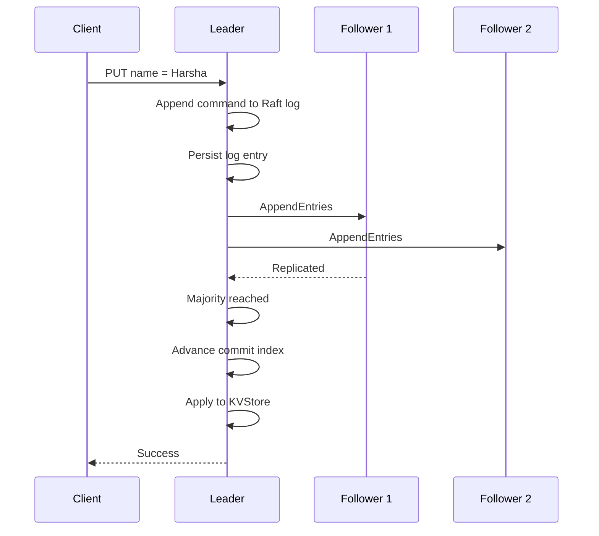

The key idea is:

> **Receiving a request is not the same as committing a request.**

For a 3-node cluster:

```text
Leader + one follower = majority
```

So one unavailable follower does not necessarily stop progress.

---

## How a Read Works

A local dictionary lookup is easy. A safe distributed read is harder because a node may think it is leader even though the network has changed.

Conceptually, a linearizable read looks like this:

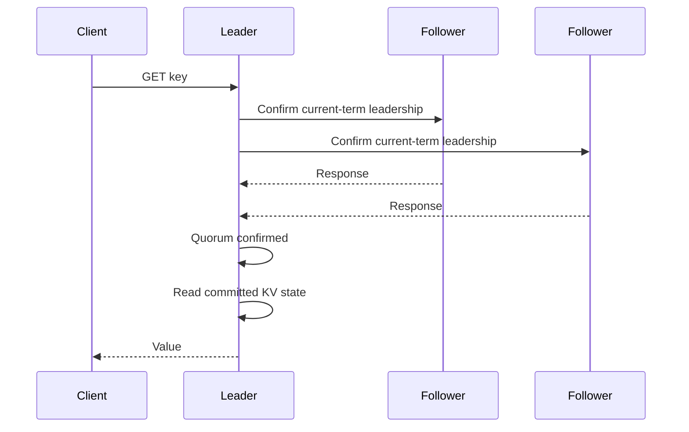

PyRaftKV also uses a conservative short read lease after safe quorum confirmation.

If the required leadership/quorum condition cannot be established, the system does not pretend an unsafe local read is authoritative.

---

## What Happens if the Leader Crashes?

Assume the cluster begins as:

```text
node1 = Leader
node2 = Follower
node3 = Follower
```

Then `node1` stops.

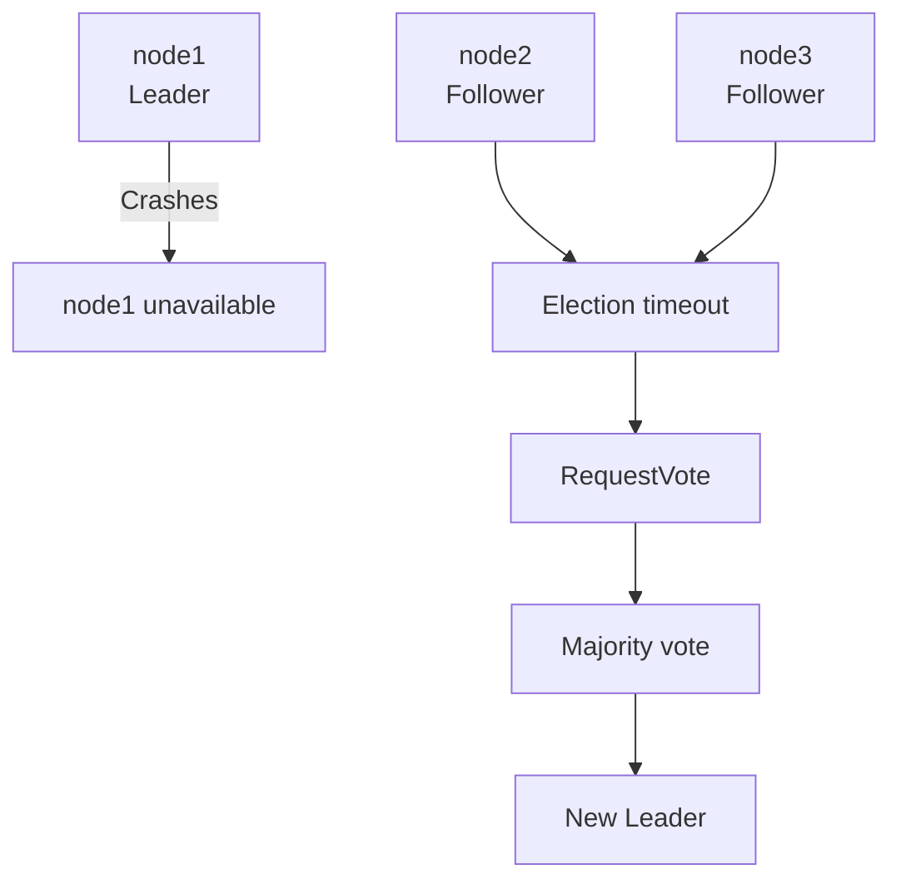

The remaining nodes can elect a new leader because two of three nodes still form a majority.

When the failed node returns, it does **not** simply restore its old leader role. It rejoins as a follower and catches up from the current leader.

### Two catch-up paths

If the missing entries are still in the leader's log:

```text
Follower behind
     |
     v
AppendEntries
     |
     v
Missing entries copied
     |
     v
Follower catches up
```

If those old entries were already compacted:

```text
Follower needs old history
        |
        v
Leader no longer has those entries
        |
        v
InstallSnapshot
        |
        v
Follower installs snapshot
        |
        v
Normal replication continues
```

---

## Snapshots and Log Compaction

Without compaction, a Raft log could grow forever.

Before compaction:

```text
1
2
3
...
98
99
100
101
102
103
```

Suppose the system creates a snapshot at index `100`.

The persisted snapshot format contains information equivalent to:

```json
{
  "version": 1,
  "last_included_index": 100,
  "last_included_term": 7,
  "state": {
    "name": "Harsha"
  }
}
```

After compaction:

```text
Snapshot represents entries <= 100

Retained log:
101
102
103
...
```

The log keeps the snapshot boundary:

```text
base_index = 100
base_term  = 7
```

This lets later Raft consistency checks continue using correct logical indexes.

---

## Persistence and Restart Recovery

Important durable state includes information such as:

```text
current term
voted-for node
commit index
Raft log
snapshot metadata
snapshot state
```

Restart recovery conceptually works like this:

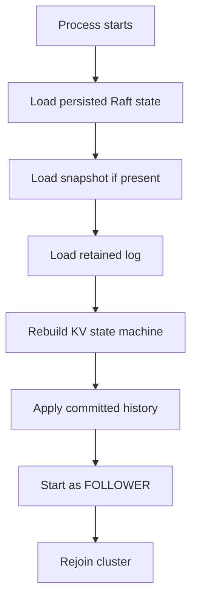

A persisted runtime role is not blindly trusted after restart. Leadership must be established again through Raft.

---

## Why a 3-Node Cluster?

Raft uses majority quorum.

For 3 nodes:

```text
quorum = 2
```

| Healthy nodes | New commits possible? |
|---:|---|
| 3 / 3 | Yes |
| 2 / 3 | Yes |
| 1 / 3 | No |

One remaining node does not have enough authority to create a new committed history by itself.

---

## Quick Start with Docker

### Requirements

You need:

- Docker
- Docker Compose

Check Docker Compose:

```bash
docker compose version
```

Clone the repository:

```bash
git clone https://github.com/harshkamble14062002/pyraftkv.git
cd pyraftkv
```

Start the full environment:

```bash
docker compose up -d --build
```

Check running services:

```bash
docker compose ps
```

The three Raft nodes are exposed as:

```text
node1 -> http://127.0.0.1:8001
node2 -> http://127.0.0.1:8002
node3 -> http://127.0.0.1:8003
```

Prometheus:

```text
http://localhost:9090
```

Grafana:

```text
http://localhost:3000
```

### Check the nodes

```bash
curl http://127.0.0.1:8001/health
curl http://127.0.0.1:8002/health
curl http://127.0.0.1:8003/health
```

For deeper Raft status:

```bash
curl http://127.0.0.1:8001/cluster/status
curl http://127.0.0.1:8002/cluster/status
curl http://127.0.0.1:8003/cluster/status
```

The elected leader is dynamic. Do not assume the same node will always lead.

---

## Using the API

Assume the elected leader is currently available at:

```text
http://127.0.0.1:8001
```

Use the actual leader's port if another node was elected.

### PUT

Store a value:

```bash
curl -X PUT \
  http://127.0.0.1:8001/kv/name \
  -H 'Content-Type: application/json' \
  -d '{"value":"Harsha"}'
```

Conceptually:

```text
name -> Harsha
```

### GET

```bash
curl http://127.0.0.1:8001/kv/name
```

### DELETE

```bash
curl -X DELETE \
  http://127.0.0.1:8001/kv/name
```

For leader-required operations, a follower can return HTTP `409` with known leader information.

A leader that cannot safely confirm the quorum required for a linearizable read can return HTTP `503` rather than claim an unsafe result is authoritative.

---

## Cluster Status

PyRaftKV provides:

```text
GET /cluster/status
```

Example:

```bash
curl -s http://127.0.0.1:8001/cluster/status | jq
```

The endpoint helps inspect information such as:

- node ID,
- current role,
- current term,
- known leader,
- commit index,
- last applied index,
- log position,
- snapshot boundary,
- cluster members,
- quorum information,
- replication progress.

It is designed for diagnostics and observability.

---

## Prometheus Metrics and Monitoring

Every node exposes Prometheus metrics at:

```text
GET /metrics
```

Example:

```bash
curl http://127.0.0.1:8001/metrics
```

Metrics cover areas such as:

- Raft term,
- node role,
- commit index,
- last applied index,
- elections,
- leadership changes,
- Raft RPC activity,
- RPC latency,
- follower replication lag,
- read barriers,
- snapshot activity,
- compaction activity,
- HTTP traffic and latency.

HTTP metric paths use bounded route templates so arbitrary user keys do not become unbounded Prometheus labels.

### Monitoring flow

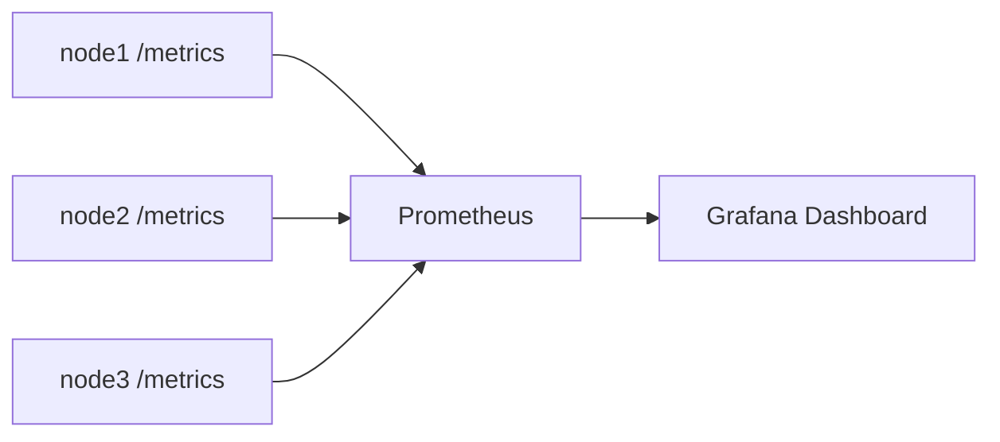

Prometheus is available at:

```text
http://localhost:9090
```

Grafana is available at:

```text
http://localhost:3000
```

The included monitoring configuration is intended for local development and demonstration.

---

## Automated Failover Demo

The fastest way to understand PyRaftKV is to run the automated failover demonstration.

With the Docker images already built:

```bash
./scripts/demo_failover.py --no-build
```

Or let the script perform its normal setup:

```bash
./scripts/demo_failover.py
```

The demo performs this flow:

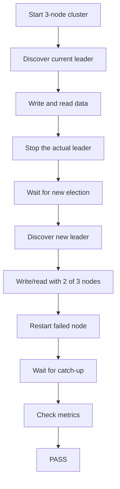

A real successful validation looked like:

```text
[demo] initial leader=node3 term=3026
[demo] committing and reading a value before failure
[demo] stopping dynamically discovered leader node3
[demo] new leader=node1 term=3027
[demo] committing and reading with two of three nodes
[demo] restarting node3 and waiting for commit index 8
[demo] PASS: leader failover, quorum write/read, restart, catch-up, and metrics checks succeeded
```

Exact node IDs, terms, and commit indexes naturally differ between runs.

### Stop the cluster

```bash
docker compose down
```

To intentionally remove Docker volumes too:

```bash
docker compose down -v
```

Be careful: `-v` removes Docker-managed persisted data.

---

## Development Setup

PyRaftKV requires:

```text
Python >= 3.12
```

Create a virtual environment:

```bash
python3 -m venv .venv
```

Activate it:

```bash
source .venv/bin/activate
```

Install the project and development dependencies:

```bash
pip install -e ".[dev]"
```

Docker Compose remains the easiest way to run the complete multi-node environment because it configures node identities, peer networking, persistence, Prometheus, and Grafana together.

---

## Testing

Run the complete test suite:

```bash
pytest
```

Run Ruff:

```bash
ruff check .
```

Check Git whitespace errors:

```bash
git diff --check
```

A useful validation sequence is:

```bash
pytest
ruff check .
git diff --check
```

The v1 project validation completed with:

```text
263 tests passed
Ruff passed
Git whitespace checks passed
```

---

## Failure and Stress Testing

Distributed systems fail in ways normal CRUD tests cannot represent.

PyRaftKV includes deterministic fault injection through its in-memory transport.

Tests can simulate:

- directional link blocking,
- full node isolation,
- symmetric network partitions,
- `RequestVote` drops,
- `AppendEntries` drops,
- delayed RPCs,
- follower failure,
- leader failure,
- node restart,
- divergent log repair,
- higher-term responses,
- snapshot transfer failures.

Example partition idea:

```text
           X
node1 ----------- node2
  |                 |
  |                 |
  +------ node3 ----+
```

The test suite also includes concurrent workloads such as:

- concurrent PUTs,
- mixed reads/writes/deletes,
- traffic during follower failure,
- traffic during leader loss,
- traffic during re-election,
- traffic while a lagging follower catches up.

### Important invariants checked

Tests protect properties such as:

```text
last_applied <= commit_index
```

and scenarios such as:

- at most one observed leader per term,
- a minority partition cannot newly commit entries,
- acknowledged committed writes are preserved,
- healthy nodes converge after a partition heals,
- compacted log indexes remain coherent,
- restarted nodes do not restore stale leadership,
- a dead peer does not unnecessarily block healthy quorum progress,
- larger clusters wait for a real quorum rather than one fast response.

These tests provide strong engineering validation, but they are not a formal mathematical proof of the complete Raft protocol.

---

## Concurrency and Slow Peers

One important liveness problem looks like this:

```text
Leader
  |
  +---- healthy follower -> fast
  |
  +---- dead follower ----> slow/unavailable
```

A slow peer should not unnecessarily freeze progress through healthy peers.

An important implementation rule is:

> Potentially blocking network I/O should not hold the main Raft state lock.

Conceptually:

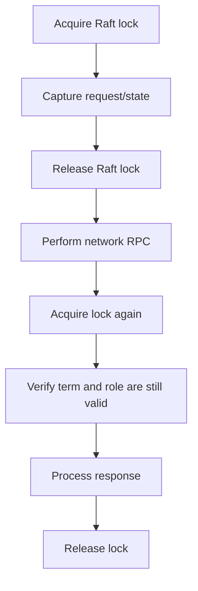

This protects shared state without allowing one unavailable peer to dominate cluster responsiveness.

---

## Raft Concepts

### Term

A **term** is similar to an election generation.

```text
Term 20 -> node1 leader
node1 fails
Term 21 -> node3 leader
```

Terms move forward. A node that discovers a higher term updates its state and steps down when required.

### Log index

Every replicated command has a logical index.

| Index | Term | Command |
|---:|---:|---|
| 1 | 5 | `PUT name=Harsha` |
| 2 | 5 | `PUT language=Python` |
| 3 | 6 | `DELETE name` |

### Commit index

The **commit index** identifies the highest log entry known to be committed.

A log entry can exist locally without yet being committed.

### Last applied

`last_applied` is the highest committed entry already applied to the key-value state machine.

Important relationship:

```text
last_applied <= commit_index
```

### next_index

For each follower, the leader tracks where replication should continue:

```text
next_index[follower]
```

### match_index

The leader tracks the highest index known to be replicated on each follower:

```text
match_index[follower]
```

These values support follower catch-up, conflict repair, and majority commit calculation.

### Major Raft RPCs

```text
RequestVote
AppendEntries
InstallSnapshot
TimeoutNow
```

- `RequestVote` is used during elections.
- `AppendEntries` carries heartbeats and replicated log entries.
- `InstallSnapshot` catches up followers behind compacted history.
- `TimeoutNow` participates in best-effort leadership transfer.

---

## Project Structure

High-level repository layout:

```text
pyraftkv/
├── src/
│   └── pyraftkv/
│       ├── api/                 # Client, admin, and Raft HTTP routes
│       ├── observability/       # Prometheus instrumentation
│       ├── raft/                # Raft algorithm and persistence logic
│       ├── storage/             # Key-value storage components
│       ├── transport/           # In-memory and HTTP transports
│       ├── runtime.py           # Node runtime loop
│       └── __init__.py
│
├── tests/
│   ├── unit/
│   ├── integration/
│   └── helpers/
│
├── benchmarks/
│   ├── benchmark_raft.py
│   └── results/
│
├── monitoring/
│   ├── prometheus/
│   └── grafana/
│
├── scripts/
│   └── demo_failover.py
│
├── docs/
│   ├── architecture.md
│   ├── raft.md
│   ├── failure-testing.md
│   ├── benchmarks.md
│   └── roadmap.md
│
├── Dockerfile
├── docker-compose.yml
├── pyproject.toml
├── RELEASE_NOTES.md
└── README.md
```

---

## Benchmarks

Benchmark tooling is available under:

```text
benchmarks/
```

The distributed Raft benchmark is in:

```text
benchmarks/benchmark_raft.py
```

Committed results are under:

```text
benchmarks/results/
```

See:

```text
docs/benchmarks.md
```

The committed local Phase-H measurements covered multiple request and failure/recovery scenarios. Recorded throughput varied significantly by scenario and reached from the low-thousands into the low-tens-of-thousands of requests per second in those local benchmark paths.

These are **local development-machine measurements**, not production capacity guarantees.

Performance depends on:

- CPU,
- storage,
- networking,
- Docker overhead,
- persistence settings,
- workload type,
- concurrency,
- benchmark method.

Always use the committed benchmark report for the exact scenario and methodology before comparing numbers.

---

## Common Failure Cases

| Situation | Expected behavior |
|---|---|
| One follower goes down | Leader can continue if the other follower still provides quorum |
| Leader goes down | Remaining majority can elect a new leader |
| Old leader returns | It rejoins as a follower and catches up |
| Follower has conflicting history | Leader repairs the follower's log |
| Follower is slightly behind | Catch up through `AppendEntries` |
| Follower is behind compacted history | Catch up through `InstallSnapshot` |
| Only one of three nodes remains | No safe quorum for new commits |
| Partition heals | Healthy nodes converge toward committed leader history |
| Node restarts | Persistent state is loaded and node rejoins as follower |

---

## Consistency Model

PyRaftKV's distributed write path is based on Raft majority commit.

For a 3-node cluster:

```text
2 nodes = quorum
```

Acknowledged committed operations follow replicated Raft history, and leader-backed reads aim to provide a linearizable view when the required safety conditions can be established.

An isolated single node is not enough authority to create new committed writes in a 3-node configuration.

---

## Current Limitations

PyRaftKV `v1.0.0` intentionally has a focused scope.

It currently does **not** provide:

- sharding,
- dynamic cluster membership,
- Raft joint-consensus membership changes,
- authentication,
- authorization,
- TLS,
- multi-tenant isolation,
- a production leader-aware client SDK,
- automatic follower proxying,
- chunk-streamed snapshot transfer,
- a full automatic snapshot/compaction storage policy,
- production backup tooling,
- rolling-upgrade compatibility guarantees.

The included Docker/Grafana configuration is intended for local development and demonstration.

---

## Documentation

For deeper explanations, read:

### Architecture

```text
docs/architecture.md
```

Components, boundaries, and data flows.

### Raft

```text
docs/raft.md
```

Leader election, replication, reads, persistence, snapshots, and recovery.

### Failure Testing

```text
docs/failure-testing.md
```

Partitions, dropped/delayed RPCs, failover, restart, snapshot recovery, and the Docker demo.

### Benchmarks

```text
docs/benchmarks.md
```

Benchmark scenarios, methodology, and interpretation.

### Roadmap

```text
docs/roadmap.md
```

Project development history and feature progression.

### Release Notes

```text
RELEASE_NOTES.md
```

`v1.0.0` release information.

---

## Release Validation

PyRaftKV `v1.0.0` was released after validation that included:

```text
263 pytest tests passing
Ruff passing
Git whitespace checks passing
Docker Compose build/start passing
real 3-node leader failover passing
2-of-3 quorum write/read passing
failed-node restart and catch-up passing
Prometheus targets healthy
Grafana health validated
```

A later test-only change made one unavailable-peer election regression test deterministic; it did not change the production behavior represented by the `v1.0.0` release.

---

## Five-Minute Learning Path

If you are new to the project, use this order:

```text
1. Read "The Big Idea"
        |
        v
2. Read "Raft in Simple Words"
        |
        v
3. Run Docker Compose
        |
        v
4. Run the automated failover demo
        |
        v
5. Inspect /cluster/status
        |
        v
6. Open Prometheus and Grafana
        |
        v
7. Read docs/raft.md
        |
        v
8. Explore the failure tests
```

That gives you both the theory and the actual cluster behavior.

---

## Short Interview Explanation

> **PyRaftKV is a fault-tolerant distributed key-value store built in Python using the Raft consensus algorithm. It implements leader election, quorum-based replicated writes, linearizable reads, durable Raft persistence, snapshots and log compaction, InstallSnapshot recovery for lagging followers, graceful leadership transfer, deterministic network-failure tests, concurrent stress tests, Prometheus/Grafana observability, and a Docker-based three-node failover demo.**

---

## Full Mental Model

The write path can be understood as:

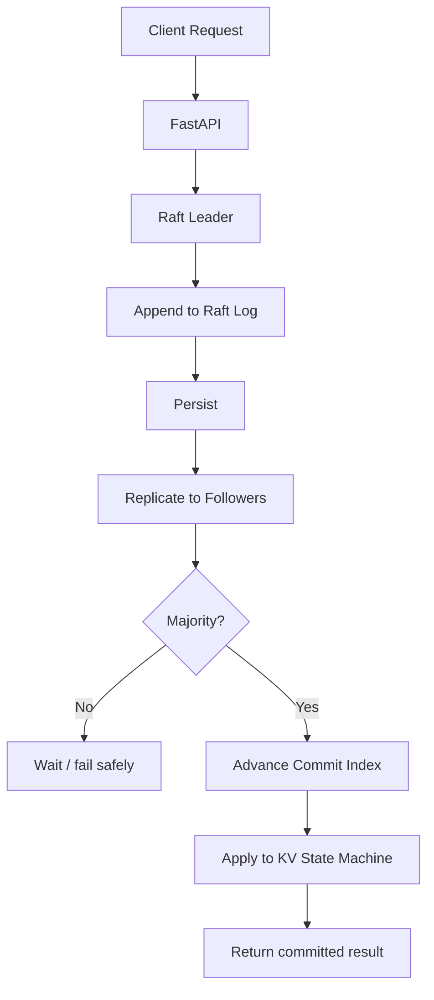

Failure recovery can be understood as:

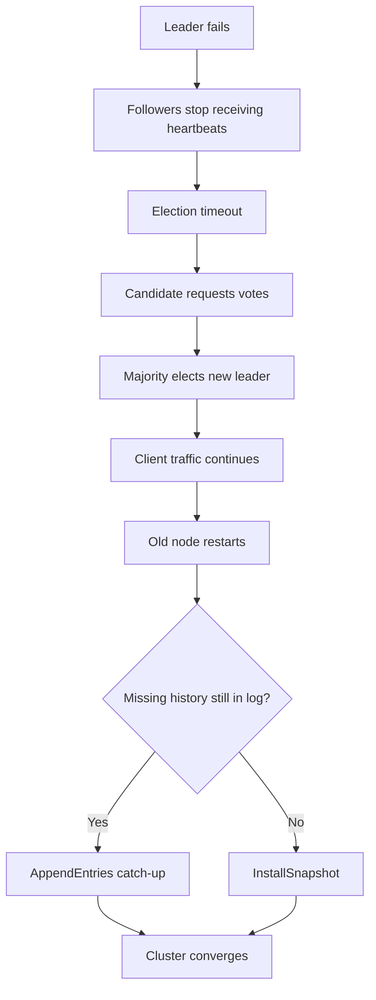

---

## Useful Commands

Start everything:

```bash
docker compose up -d --build
```

Show containers:

```bash
docker compose ps
```

Follow node logs:

```bash
docker compose logs -f node1 node2 node3
```

Inspect a node:

```bash
curl -s http://127.0.0.1:8001/cluster/status | jq
```

Run the failover demo:

```bash
./scripts/demo_failover.py --no-build
```

Run tests:

```bash
pytest
```

Run linting:

```bash
ruff check .
```

Stop the cluster:

```bash
docker compose down
```

---

## Release

Current stable release:

```text
v1.0.0
```

Repository:

```text
https://github.com/harshkamble14062002/pyraftkv
```

---

## Final Note

PyRaftKV is designed to make distributed-system behavior visible instead of hiding it.

The most important lifecycle to understand is:

```text
elect a leader
      ↓
accept a write
      ↓
replicate it
      ↓
reach quorum
      ↓
commit it
      ↓
serve a safe read
      ↓
kill the leader
      ↓
elect a new leader
      ↓
continue with 2/3 nodes
      ↓
restart the failed node
      ↓
catch it up
      ↓
converge again
```

That is the central idea behind PyRaftKV: **multiple machines cooperating to maintain one agreed history even when individual nodes fail.**
